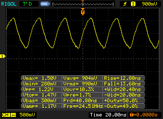

# i.MX93 CCM CLKO driver

Linux kernel driver to enable clock output of the CCM module found on i.MX93 SoCs.

## Instructions

### Building

* Clone repository
* Source toolchain SDK (export CC, CROSS_COMPILE, ARCH) e.g.
```
source /opt/toolchains/setup-gcc-arm-8.3-2019.03-x86_64-aarch64-linux-gnu
```
* Export KERNEL_SRC variable to location of the linux kernel
```
export KERNEL_SRC="/home/user/sources/linux-imx"
```
* Make
```
make
```

### Device-tree bindings

* Use this device-tree overlay to instantiate driver
```
#include <dt-bindings/clock/imx93-clock.h>
#include <dt-bindings/gpio/gpio.h>
#include "imx93-pinfunc.h"

/dts-v1/;
/plugin/;

&{/} {
	clock-ccm-cko1 {
		compatible = "nxp,imx93-ccm-clko";
		assigned-clocks = <&clk IMX93_CLK_CCM_CKO1>;
		assigned-clock-parents = <&clk IMX93_CLK_AUDIO_PLL>;
		assigned-clock-rates = <24576000>;
		clocks = <&clk IMX93_CLK_CCM_CKO1>;
		clock-names = "ccm_cko1";
		pinctrl-names = "default";
		pinctrl-0 = <&pinctrl_ccm_clko1>;
		status = "okay";
	};
};

&iomuxc {
	pinctrl_ccm_clko1: ccmclko1grp {
		fsl,pins = <
			MX93_PAD_CCM_CLKO1__CCMSRCGPCMIX_CLKO1	0x1FE
		>;
	};
};

```

### Loading driver

* Load the driver into running linux kernel
```
insmod imx93-ccm-clko.ko
```

### Driver output

* Observe kernel output similar to

```
$ dmesg | grep -i ccm
[    1.332579] imx93-ccm-clko clock-ccm-cko1: Driver probing...
[    1.338265] imx93-ccm-clko clock-ccm-cko1: Enabling clock
[    1.343664] imx93-ccm-clko clock-ccm-cko1: Clock rate = 24576000
```

### Oscilloscope output

* Connect probe to CCM_CLKO1 (or other CCM_CLKO pad defined in dts) and observe signal


## Authors

Primoz Fiser <primoz.fiser@norik.com>

## License

This project is licensed under the GPL-2.0 License - see the COPYING file for details

